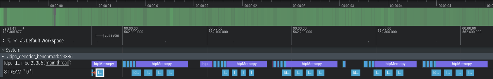
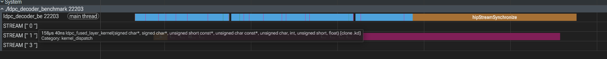

# ROCm-OCUDU

OCUDU (https://gitlab.com/ocudu/ocudu) is a permissively-licensed, open-source 5G (and beyond) CU/DU project designed for commercial deployment and broad industry adoption, as well as advanced research and development. OCUDU is a complete radio access network (RAN) solution compliant with 3GPP and O-RAN Alliance specifications and includes the full L1/2/3 stack with minimal external dependencies. OCUDU is governed under the Linux Foundation. For further information, please check [README-OCUDU](./README-OCUDU.md).

This repository is based on OCUDU and aims to explore GPU acceleration for 5G workloads using AMD ROCm.

## License

This project is licensed under the BSD 3-Clause Open MPI variant License – see the [LICENSE](./LICENSE) file for details.
Portions of this software may implement 3GPP specifications, which may be subject to additional licensing requirements.

## Testing LDPC Decoder

Current version implements **Layered LDPC decoding kernels** for **5G PHY** workloads using **AMD ROCm 7+**.

### Decoding Pipeline
The implementation follows a **Layered Iterative Message-Passing** approach. Instead of updating the entire matrix at once, the parity check matrix is processed in layers to achieve faster convergence. For each iteration and each layer, the fused kernel executes:

1.  **Variable-to-Check Update:** Processes messages from variable nodes to check nodes for the current layer.
2.  **Check-to-Variable Update:** Computes parity constraints and updates messages back to variable nodes.
3.  **Soft-bit (Posterior LLR) Update:** Updates the soft bits before moving to the next layer or iteration.

This design was chosen to simplify validation against a **CPU reference** and allow independent debugging of each step of the layered update.

### Requirements

To build and run this project, you need the following environment:

*   **Operating System:** Ubuntu 24.04
*   **ROCm Stack:** Version **7.0 or higher** (tested on ROCm 7.x)
*   **Compiler:** `hipcc` (part of the ROCm toolkit)
*   **GPU:** AMD Radeon or Instinct GPU with **ROCm support** (e.g., RDNA 2/3 or CDNA architectures)
*   **Dependencies:** Based on the **ocudu** framework (ensure all ocudu-specific dependencies are met)

### Hardware & Environment
*   **Tested on:** AMD Radeon **RX 6500 XT** (Target: `gfx1030`)
*   **ROCm Version:** 7.0+
*   **Override Note:** If the GPU is not officially supported by your ROCm version, you may need to set the following environment variable before running:
    ```bash
    export HSA_OVERRIDE_GFX_VERSION=10.3.0
    ```
### How to Build
A helper script (`build_ocudu.sh`) is provided to automate the environment setup and build process. 
It adds the current user to the render and video groups, sets gfx1030 support, configures CMake with ROCm 7+ paths and compiles the project using hipcc.
After a successful build, go to the benchmark directory `build/tests/benchmarks/phy/upper/channel_coding/ldpc` and run `./ldpc_decoder_benchmark`.


### LDPC Decoder Performance Analysis (AMD 6500 XT - RDNA2)
*   **Initial Benchmark Results**
Before implementing batching and asynchronous streams, we measured the performance of the Fused HIP Kernel on an AMD Radeon RX 6500 XT (16 CUs, 4GB VRAM) compared to the generic CPU implementation.

| Configuration | Device | 50th | 75th | 90th | 99th | 99.9th | Speedup (50th) |
| --- | --- | --- | --- | --- | --- | --- | --- |
| **BG1, LS=384, R=0.917** | GPU | 19.4 | 19.3 | 19.0 | 5.8 | 0.0 | **4.3x** |
| | CPU | 4.5 | 4.4 | 4.4 | 4.0 | 3.2 | |
| **BG1, LS=384, R=0.333** | GPU | 5.2 | 5.1 | 3.7 | 3.6 | 1.8 | **5.7x** |
| | CPU | 0.9 | 0.9 | 0.9 | 0.9 | 0.9 | |
| **BG2, LS=384, R=0.833** | GPU | 11.6 | 11.4 | 10.7 | 3.9 | 2.7 | **2.5x** |
| | CPU | 4.5 | 4.4 | 4.4 | 4.4 | 4.3 | |
| **BG2, LS=384, R=0.200** | GPU | 3.0 | 2.9 | 2.9 | 1.9 | 1.0 | **4.2x** |
| | CPU | 0.7 | 0.7 | 0.7 | 0.6 | 0.6 | |

While the GPU significantly outperforms the CPU in median throughput (50th percentile), it exhibits performance drops at the tail percentiles (99.9th). 
This behavior confirms that the current implementation is bottlenecked by synchronous host-device communication, leading to complete stalls (0.0 Mbps) during kernel dispatching.
The GPU performs better in scenarios with larger code lengths (e.g., cb_len=25344). This indicates that as the computational workload per codeword increases, the data transfer overhead is better "amortized" over the total execution time. While CPU maintains stable and predictable performance (dropping only from 4.5 to 3.2 Mbps at the 99.9th percentile), the GPU experiences a reduction from 19.4 to 0.0 Mbps at the 99.9th percentile. The "0.0 Mbps" result indicates intermittent system stalls caused by synchronous calls (hipMemcpy), where the CPU blocks wait for the GPU and vice versa.

1.  **Host-device sync overhead:** Processing one codeword at a time forces the GPU to wait for the CPU to dispatch the next command. Profiling shows many idle gaps where the overhead of launching kernels exceeds the actual computation time.
2.  **Hardware Underutilization:** With a lifting size of 384, the kernel occupies only one block / one CU (out of 16 CUs on the RX 6500 XT GPU).
3.  **Synchronous Memory Stalls:** The drop to 0.0 Mbps at the 99.9th percentile indicates severe latency spikes caused by synchronous hipMemcpy calls and OS scheduling, preventing a continuous data pipeline.


<p align="center">
  
  <br>
  <em>Figure 1: Perfetto trace showing scattered kernel execution (blue) and host-side gaps.</em>
</p>

Trace generated as follows:
   ```bash
   cd ~/ROCm-OCUDU/tests/benchmarks/phy/upper/channel_coding/ldpc/
   rocprofv3 --hip-trace --kernel-trace --output-format pftrace -- ./ldpc_decoder_benchmark -L 384
   ```

The profiling results indicate that the system is heavily communication-bound, with the GPU remaining idle for nearly 60% of the total execution time. This high idle percentage is a direct consequence of the synchronous host-device communication and the serial nature of the layer-by-layer kernel dispatch. With a lifting size of 384, the computational workload per kernel (~45 μs) is insufficient to hide the launch overhead and the significant inter-kernel gaps (up to 307 μs), leading to the observed throughput stalls at the tail percentiles.

To extract the GPU utilization metrics, the following query was used:
```bash
SELECT 
    ((total.total_dur - active.active_dur) * 100.0 / total.total_dur) AS idle_percentage,
    (active.active_dur * 100.0 / total.total_dur) AS active_percentage
FROM 
    (SELECT (MAX(ts + dur) - MIN(ts)) as total_dur FROM slice WHERE name LIKE 'ldpc%') AS total,
    (SELECT SUM(dur) as active_dur FROM slice WHERE name LIKE 'ldpc%') AS active;
```


*   **Batching implementation - no streams**

A **multi-codeword batching** strategy was implemented, consolidating 256 parallel codewords into a single kernel dispatch. Although throughput scales up to 13.0x, the profile also exposes a batch-serial synchronization issue, where the system spends almost 80% of its time on host-side formatting. As the execution pipeline is currently single-stream, the GPU remains completely starved during the large inter-batch gaps while the CPU sequentially processes the heavy interleave() memory layout transformation for the subsequent batch.


| Configuration | Device | 50th | 75th | 90th | 99th | 99.9th | 99.99th | Worst |
| --- | --- | --- | --- | --- | --- | --- | --- | --- |
| **BG1, LS=384, R=0.917** | GPU | 62.0 | 61.2 | 60.3 | 58.6 | 44.1 | 44.1 | 44.1 |
| **BG1, LS=384, R=0.333** | GPU | 60.8 | 60.2 | 59.6 | 59.0 | 56.7 | 56.7 | 56.7 |
| **BG2, LS=384, R=0.833** | GPU | 39.7 | 39.1 | 38.3 | 37.6 | 35.1 | 35.1 | 35.1 |
| **BG2, LS=384, R=0.200** | GPU | 39.0 | 38.6 | 37.7 | 36.8 | 32.0 | 32.0 | 32.0 |

Based on the data from the `XXXXX_agent_info.csv` file, generated with the command:
```bash
rocprofv3 --hip-trace --sys-trace --stats --output-format csv -- ./ldpc_decoder_benchmark -L 384 -T hip
```

the ROCm runtime confirms the following hardware specifications and execution analysis:
The kernel was restricted to a single block, utilizing only 1 out of the 16 available CUs on the AMD RX 6500 XT in the initial version. By batching 256 codewords, the grid size expands sufficiently to saturate all 16 CUs simultaneously. The GPU operates in Wave32 mode. A 256-thread block divides into exactly 8 waves. A workload of 384 blocks results in 24 blocks assigned per CU. Each CU accommodates a maximum of 1024 concurrent threads (32 waves x 32 threads). This allows up to 4 blocks to be in-flight simultaneously (4 x 256 threads = 1024). With 24 blocks requiring 192 total waves (24 x 8), and a maximum capacity of 32 waves per CU, the GPU scheduler can execute the workload in 6 consecutive execution waves,provided that the kernel's internal register usage (VGPRs) or LDS usage is low enough to not artificially lower this capacity.

While the hipMemcpyAsync calls are non-blocking, the hardcoded hipStreamSynchronize at the end of decode_batch() forces a strict sequential dependency: Host preparation (interleave) --> GPU kernel execution --> Host synchronization. As only one stream lane (track_id = 0) is used, the CPU cannot begin interleaving data for Batch \(N+1\) until the GPU completely finishes and synchronizes Batch \(N\). The system is no longer bottlenecked by raw GPU execution, but by host-side memory preparation stalls, validating the need for an asynchronous multi-stream pipeline.

<p align="center">
  
  <br>
  <em>Figure 1: Perfetto trace showing the Batch-Serial synchronization bottleneck. The host CPU (main thread) enters a blocking state inside hipStreamSynchronize (brown bar) and remains entirely stalled, waiting for the GPU to complete the execution of the heavy ldpc_fused_layer_kernel (purple bar on STREAM ["1"]).</em>
</p>


### Next Steps
- **Asynchronous pipeline (HIP Streams):** Use hipStream_t and hipMemcpyAsync to overlap data transfers with kernel execution. While the GPU is decoding batch N, the PCIe bus will be transferring batch N+1.
- **Local data share (LDS) Optimization:** Move LLR data from registers to LDS in order to allow more batches to run concurrently per CU.

